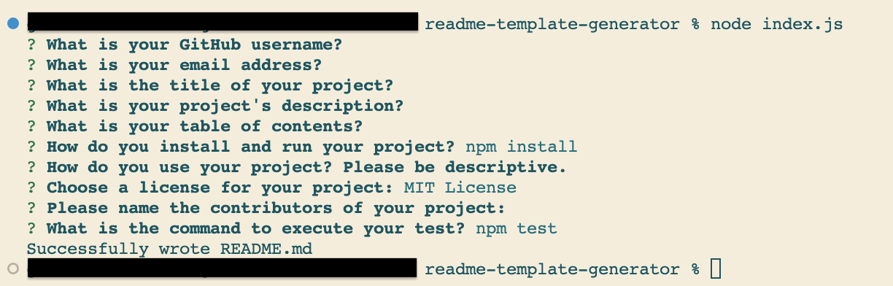

# README Template Generator

  ## Table of contents
  - [Description](#description)
  - [Installation](#installation)
  - [Usage](#usage)
  - [License](#license)
  - [Contributing](#contributing)
  - [Test](#test)
  
  ## Description
  This is a command line application that generates a high-quality README file for a given project. It prompts the user with a series of questions about their project, such as the project's title, description, usage, installation instructions, licensing, testing, and contributors. It then uses the user's answers to create a professional-looking README file in markdown format that includes all of the necessary sections for a great README file. The application is easy to use and produces excellent results, saving the user time and effort in creating a good README file.

  ## Installation
  Make sure you have Node.js installed on your machine. You can download it from the official website (https://nodejs.org/).

* Create a new directory for your project and navigate to it using **your terminal or command prompt**.

* Create a new file called index.js and copy the code for the README generator into it.

* Create a new directory called utils and inside it create a new file called generateMarkdown.js. Copy the code for the generateMarkdown function into this file.

* In your terminal, navigate to the root directory of your project and **run npm init** to create a new package.json file.

* Install the required dependencies by running the following command in your terminal: **npm install inquirer**.

  ## Usage
* Once the installation is complete, run the index.js file by running the command **node index.js** in your terminal.

* Follow the prompts to answer the questions about your project.

* Once you have answered all the questions, a new README file called README.md will be generated in the root directory of your project.

* Open the README.md file to review and make any necessary edits. 

And that's it! You should now be able to run the application locally on your machine.

  ## License
  This application is covered under the MIT License.

  ## Contributing
  N/A

  ## Test
  npm test

  ## Questions
  If you have any questions, please feel free to ask me at camelia_hodorogea@yahoo.com. You can also visit my [GitHub Profile](https://github.com/GinaCamelia).
